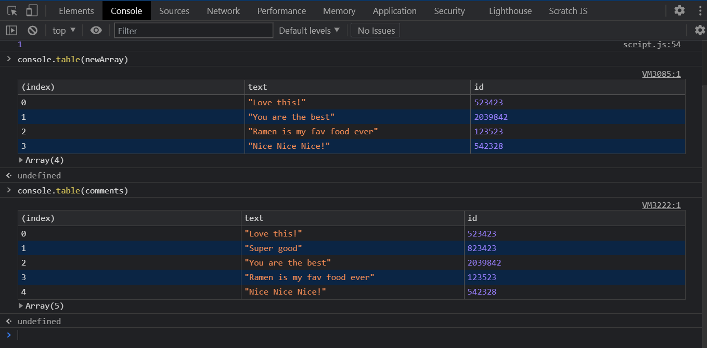

# JS-30-DAY-7

[demo](https://cenacrharsh.github.io/JS-30-DAY-7/)

### Lessons Learned:

- used `Array.prototype.some()`
- used `Array.prototype.every()`
- used `Array.prototype.find()`
- used `Array.prototype.findIndex()`
